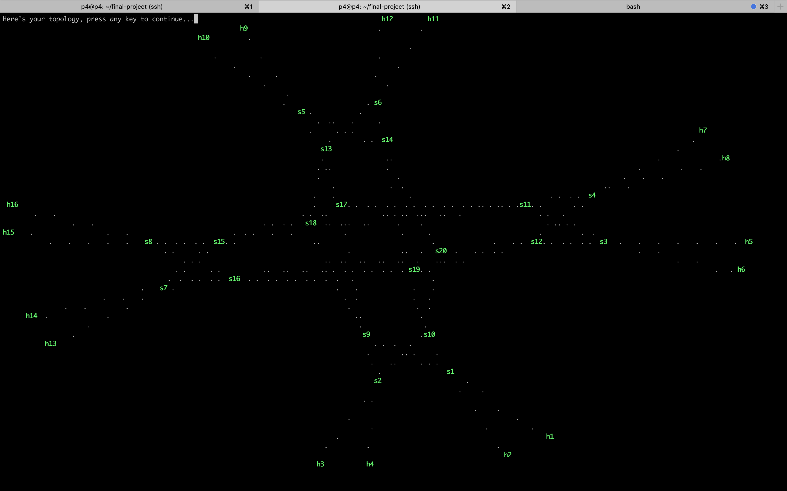

Automated Topology Visualization in P4
======================================

The goal of this project is to allow students to visualize their topology in their p4 environment through the terminal. This projects uses ideas inspired from http://www.itginsight.com/Files/paper/AN%20ALGORITHM%20FOR%20DRAWING%20GENERAL%20UNDIRECTED%20GRAPHS(Kadama%20Kawai%20layout).pdf. The idea is to organize the topology based on theoretical graph distance between nodes (ie. the length of the shortest path between nodes). The algorithm runs 2000 iterations on a 4-fattree topology in about 5 seconds.

This algorithm should work on any topology, here are some example:

Line Topology
-------------

Medium Topology
---------------

Fattree Topology
----------------

Instructions
------------
There are two main files in this program: `draw_topology.py` and `save_topology.py`.
1. `save_topology.py` should be run in the controller. The controller should `import save_topology` and call `save_topology.main(self.topo)`, where `self.topo` is the controller's topology object. This will generate two files `edges.csv` and `paths.csv`, containing the topology information needed by the program. See `controller/routing-controller.py` for an example.
1. run `python3 controller/draw_topology.py` in the same directory as the generated csv files. This could take about 5 seconds for a 4-fattree topology.
1. Alternatively, run `python3 controller/draw_topology.py true` to see the training process animation.
